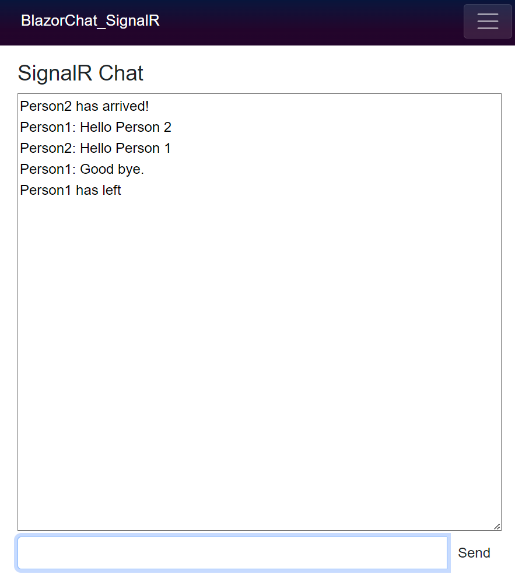

# BlazorChat_SignalR

A chat application built with Blazor and SignalR.

## NuGet Packages

- **Microsoft.AspNetCore.SignalR.Client**

## Overview

This repository contains a chat application implemented using Blazor and SignalR, enabling real-time communication between users.

### Features

- Real-time chat using SignalR.
- Connect to the chat by entering your username.
- Send and receive messages instantly.

### Resources

- Official Microsoft ASP.NET Core SignalR documentation: [SignalR with Blazor](https://learn.microsoft.com/en-us/aspnet/core/blazor/tutorials/signalr-blazor?view=aspnetcore-8.0&tabs=visual-studio)

